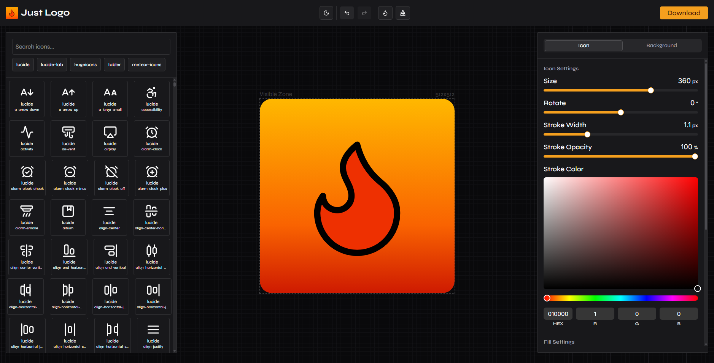

<div align="center">


<h1>Just Logo</h1>

<h3>A Multi-Source Logo Generator</h3>

[Website](https://just-logo.vercel.app)



</div>

## ✨ Introduction

This is a simple tool that helps you create logos for your side projects using icons from multiple libraries.

I know there are many logo generator tools that work in similar ways, but I’m not aware of any that allow using multiple icon libraries at the same time. Most of these tools are typically based on a single library.

The live version currently uses icons from five different icon libraries. When running it locally, you can add more libraries or swap them out.

## 🚀 Features

- 📚 Multiple icon libraries:
  - [Lucide Icons](https://lucide.dev/icons/)
  - [Lucide Lab](https://lucide.dev/icons/)
  - [Tabler Icons](https://tabler-icons.io/)
  - [Meteor Icons](https://meteoricons.com/)
  - [HugeIcons](https://hugeicons.com/) (free icons only)
- 🎨 Customize colors, sizes, and layouts
- 💾 Export logos in **PNG** and **SVG** formats
- 🔄 History management with **undo/redo** functionality
- ⌨️ Keyboard shortcuts for faster editing

## 🛠️ Built With

- [TanStack Start](https://tanstack.com/start/latest)
- [Tailwind CSS](https://tailwindcss.com/)
- [Shadcn UI](https://ui.shadcn.com/)
- [Iconify](https://iconify.design/)

## 🏁 Getting Started

To run this project locally, follow these steps:

### 📋 Prerequisites

- Node.js (>= 18)
- pnpm

### ⚙️ Installation & Setup

1. Clone the repository:

   ```bash
   git clone https://github.com/ahmedsemih/just-logo.git
   ```

2. Navigate to the project directory:

   ```bash
   cd just-logo
   ```

3. Install dependencies:

   ```bash
   pnpm install
   ```

4. Run the icon generation script to generate icons-db.json file:

   ```bash
   pnpm generate:icons
   ```

5. Start the development server:
   ```bash
   pnpm dev
   ```

## 📚 Using Other Icon Libraries

You can expand the icon selection by adding other icon libraries supported by [Iconify](https://icon-sets.iconify.design/).

1. Open `src/lib/constants.ts` file.
2. Modify the `AVAILABLE_ICON_SETS` array to include the names of the icon libraries you want to use.
3. Save the file and run the icon generation script again:
   ```bash
   pnpm generate:icons
   ```

## 🤝 Contributing

Contributions are welcome!

Feature requests and ideas should be discussed via issues first.  

Pull requests are welcome for bug fixes and small, focused improvements.

## 💬 Feedback & Support

Your feedback is very important! If you like the project, a ⭐️ would make my day.

If you have any questions or suggestions feel free to open an issue.

## 📄 License

Distributed under the [MIT License](LICENSE)

---

Made by Ahmed Semih Erkan with ❤️
